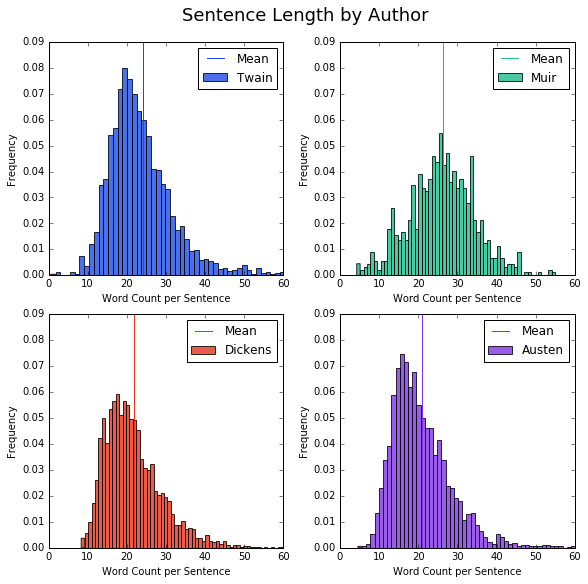
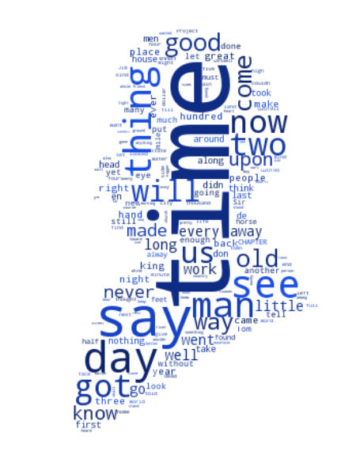
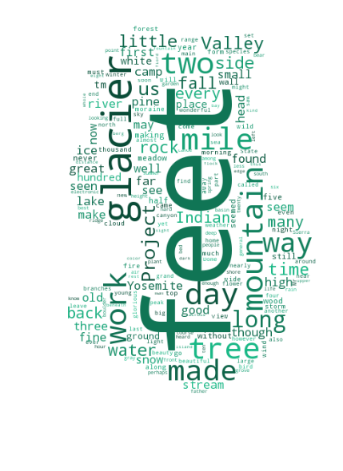
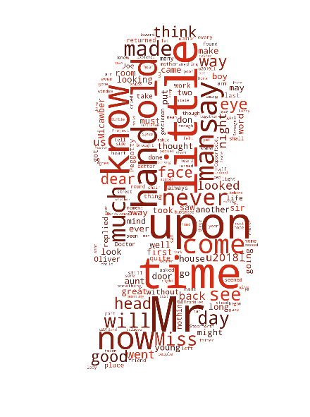
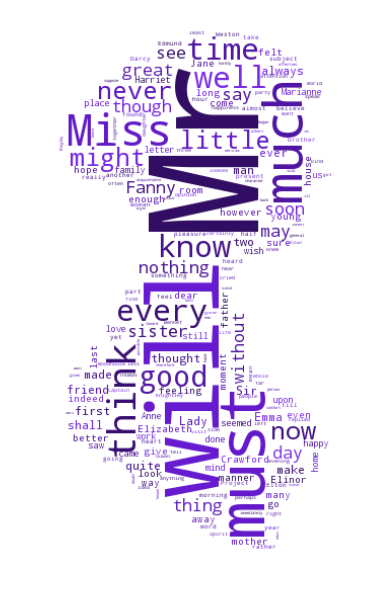

## Natural Language Processing Using Spark

This project is a collaboration with <a href="https://github.com/coradek">Evan Adkins</a> and <a href="https://github.com/nickbuker">Nick Buker</a>. We collected novels by Mark Twain, John Muir, Charles Dickens, and Jane Austen from Project Gutenberg and processed the text in Apache Spark.

In addition to the original text, parameters like average word length and number of words per sentence were calculated for each of the four authors.

Word clouds were generated for each author.

